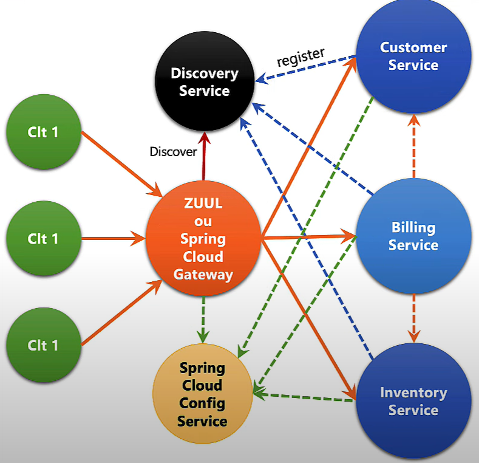
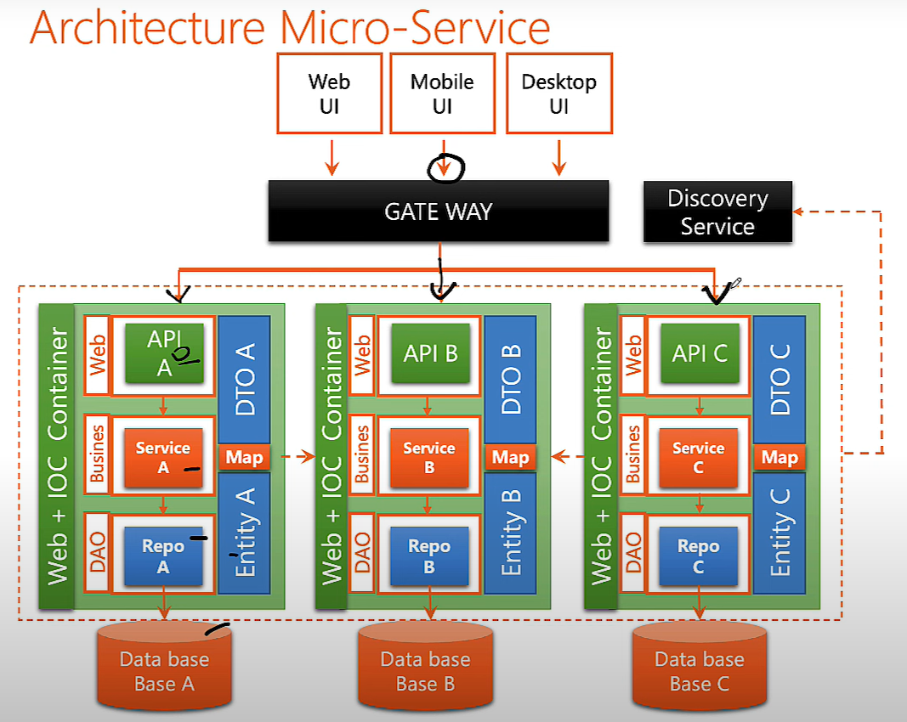

# MS architecture + interactions

## Further steps:
* Implement Docker to the app
* Implement kubernetes to manage containers

## Reminder
### 📦 spring-boot-starter-actuator
* Purpose: Exposes production-ready endpoints (health checks, metrics, etc.).
* Use case: Enables monitoring tools like Prometheus, shows app status at /actuator/*.

### 📦 spring-boot-starter-data-jpa
* Purpose: Integrates Spring Data with JPA (usually Hibernate).
* Use case: Simplifies database interactions via repositories and ORM mapping.

### 📦 spring-boot-starter-data-rest
* Purpose: Automatically exposes JPA repositories as REST endpoints.
* Use case: Quickly turn your repository methods into a REST API without writing controllers.

### ☁️ spring-cloud-starter-config
* Purpose: Connects your microservice to a centralized Spring Cloud Config Server.
* Use case: Externalizes configuration (like application.yml) so you can manage it remotely.

### ☁️ spring-cloud-starter-netflix-eureka-client
* Purpose: Registers your microservice with a Eureka Discovery Server.
* Use case: Enables service discovery — other services can find and communicate with it by name instead of hardcoded URLs.

- **Gateway**: Receives every client request and decides *which microservice* should handle it.
- **Discovery Service**: Keeps track of all running service instances and provides the **current network address** of the target service to the gateway.
  > This way, the gateway doesn’t need hard-coded URLs — it just asks the discovery service where to send the request.

# 📐 Microservice Architecture – Overview

This project follows a **classic microservice architecture** using Spring Boot.  
Each functional domain (A, B, C) is isolated into its own service, database, and API, while communication and routing are centralized through a gateway and discovery service.

---

## 🔑 Key Components

- **User Interfaces (Web/Mobile/Desktop)**  
  All client applications communicate through the **API Gateway**, never directly with services.  
  This ensures security, centralized routing, and simplified client logic.

- **Gateway (Spring Cloud Gateway / Zuul)**
    - Acts as the single entry point into the system.
    - Handles routing to the correct microservice.
    - Can apply cross-cutting concerns such as authentication, logging, and throttling.

- **Discovery Service (Eureka/Consul/Zookeeper)**
    - Keeps track of all running microservices and their instances.
    - Allows the gateway and services to dynamically locate one another (no hard-coded URLs).

---

## 🏗️ Inside Each Microservice

Every microservice (A, B, C) follows a layered structure:

- **API Layer (Controller)**  
  Exposes REST endpoints to the outside world and receives requests via the gateway.

- **DTO (Data Transfer Objects)**  
  Used to move data between layers or services, preventing direct exposure of internal entities.

- **Service (Business Logic)**  
  Implements the core rules and workflows of the microservice, coordinating between repository and API layers.

- **Entity**  
  Represents the domain model stored in the database.

- **Repository / DAO**  
  Manages persistence with the microservice’s dedicated database.  
  Each service owns its schema, ensuring **data isolation**.

- **Mapper**  
  Translates between Entities and DTOs, keeping separation of concerns clean.

- **IOC Container (Spring Boot)**  
  Provides dependency injection, configuration management, and lifecycle handling.

---

## 💾 Databases

- Each microservice owns **its own database** (A, B, C).
- This ensures **loose coupling** and **independent scaling**, avoiding a shared schema that could become a bottleneck.

---

## 📌 Benefits of this Architecture

- **Scalability** – services can scale independently.
- **Fault isolation** – one service failing does not bring down the whole system.
- **Flexibility** – each service can be developed, deployed, and versioned independently.
- **Polyglot persistence** – each microservice can choose its own database technology.

---

## 📝 Quick Summary (for top of README)

- Each service has its **own API, business logic, repository, and database**.
- A **Gateway** centralizes entry points for clients.
- A **Discovery Service** registers and locates microservices dynamically.
- **DTOs and Mappers** ensure clean separation between internal models and exposed data.
- The architecture provides **scalability, fault tolerance, and flexibility**.

---
